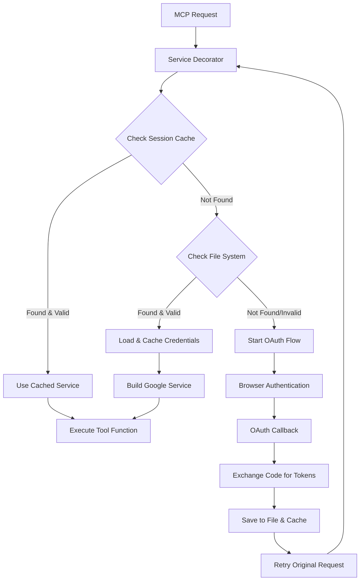
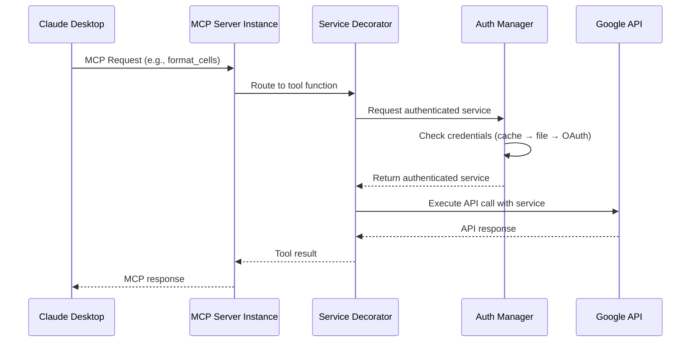

# Google Workspace MCP: Authentication & Request Routing Guide

## Overview

This document provides a comprehensive guide to how authentication and request routing works in the Google Workspace MCP (Model Context Protocol) server. Understanding this flow is essential for developers working with or extending the system.

## Architecture Overview

The Google Workspace MCP server uses a **modular, tool-specific architecture** with **decorator-based authentication** to provide seamless access to Google Workspace services.

### Key Components

1. **MCP Server** - FastMCP-based server handling protocol communication
2. **Authentication Layer** - OAuth 2.0 with automatic token management
3. **Service Decorators** - Automatic service injection and authentication
4. **Tool Modules** - Service-specific tool implementations
5. **Multi-Server Architecture** - Tool-specific server instances

---

## Authentication Flow

### 1. Authentication Architecture

```
┌─────────────────┐    ┌──────────────────┐    ┌─────────────────┐
│   MCP Request   │───▶│  Service         │───▶│  Google API     │
│                 │    │  Decorator       │    │  Service        │
└─────────────────┘    └──────────────────┘    └─────────────────┘
                              │
                              ▼
                       ┌──────────────────┐
                       │  Authentication  │
                       │  Manager         │
                       └──────────────────┘
                              │
                    ┌─────────┼─────────┐
                    ▼         ▼         ▼
              ┌──────────┐ ┌──────┐ ┌──────────┐
              │ Session  │ │ File │ │  OAuth   │
              │  Cache   │ │ Store│ │  Flow    │
              └──────────┘ └──────┘ └──────────┘
```

### 2. Credential Storage Hierarchy

The system uses a **three-tier credential storage strategy**:

#### Tier 1: Session Cache (In-Memory)
- **Location**: `_SESSION_CREDENTIALS_CACHE` dictionary
- **Duration**: 30 minutes TTL
- **Purpose**: Fast access for active sessions
- **Key Format**: `{user_email}:{service_name}:{version}:{scopes}`

#### Tier 2: File System (Persistent)
- **Location**: `~/.google_workspace_mcp/credentials/{email}.json`
- **Duration**: Until token expiration or revocation
- **Purpose**: Persistent storage across server restarts
- **Format**: JSON with token, refresh_token, scopes, etc.

#### Tier 3: OAuth Flow (Re-authentication)
- **Trigger**: No valid credentials found
- **Process**: Browser-based OAuth 2.0 flow
- **Result**: New credentials saved to both cache and file

### 3. Authentication Process Flow



### 4. Service Decorator Pattern

Each tool function uses the `@require_google_service` decorator:

```python
@server.tool()
@require_google_service("sheets", "sheets_write")  # service_type, scopes
async def format_cells(
    service,  # ← Automatically injected Google Sheets service
    user_google_email: str,
    spreadsheet_id: str,
    range: str,
    # ... other parameters
) -> str:
    # Function receives authenticated service ready to use
    result = await asyncio.to_thread(
        service.spreadsheets().batchUpdate,
        spreadsheetId=spreadsheet_id,
        body=request_body
    )
```

**What the decorator does:**
1. Extracts `user_google_email` from function parameters
2. Looks up or creates authenticated Google service
3. Injects service as first parameter to the function
4. Handles authentication errors gracefully
5. Manages token refresh automatically

---

## Request Routing

### 1. Multi-Server Architecture

The system runs **multiple server instances**, each handling specific tools:

| Server Instance | Port | Tools | Purpose |
|---|---|---|---|
| `google_sheets` | 8000 | sheets, drive | Spreadsheet operations |
| `google_slides` | 8001 | slides, drive | Presentation operations |
| `google_docs` | 8002 | docs, drive | Document operations |
| `google_communication` | 8003 | gmail, chat | Communication tools |
| `google_calendar_tasks` | 8004 | calendar, tasks | Scheduling tools |
| `google_forms` | 8005 | forms, drive | Form operations |

### 2. Request Routing Flow



### 3. Tool Registration Process

When a server starts:

1. **Module Import**: Server imports specified tool modules based on `--tools` parameter
2. **Decorator Registration**: `@server.tool()` decorators register functions as MCP tools
3. **Service Discovery**: Each tool specifies required Google services and scopes
4. **Runtime Routing**: MCP requests route to registered tools by name

Example from `main.py`:
```python
# Import tool modules to register them
tool_imports = {
    'gmail': lambda: __import__('gmail.gmail_tools'),
    'drive': lambda: __import__('gdrive.drive_tools'),
    'sheets': lambda: __import__('gsheets.sheets_tools'),
    # ...
}

# Load only specified tools
tools_to_import = args.tools if args.tools else tool_imports.keys()
for tool in tools_to_import:
    tool_imports[tool]()  # Imports module, registers tools via decorators
```

---

## Authentication Configuration

### 1. OAuth Client Setup

The system supports **two configuration methods**:

#### Method 1: Environment Variables (Recommended)
```bash
export GOOGLE_OAUTH_CLIENT_ID="your-client-id"
export GOOGLE_OAUTH_CLIENT_SECRET="your-client-secret"
export GOOGLE_OAUTH_REDIRECT_URI="http://localhost:8000/oauth2callback"  # optional
```

#### Method 2: Client Secrets File
```json
// client_secret.json
{
  "web": {
    "client_id": "your-client-id",
    "client_secret": "your-client-secret",
    "auth_uri": "https://accounts.google.com/o/oauth2/auth",
    "token_uri": "https://oauth2.googleapis.com/token"
  }
}
```

### 2. Scope Management

Scopes are organized by service and permission level:

```python
SCOPE_GROUPS = {
    # Gmail scopes
    "gmail_read": GMAIL_READONLY_SCOPE,
    "gmail_send": GMAIL_SEND_SCOPE,
    
    # Drive scopes  
    "drive_read": DRIVE_READONLY_SCOPE,
    "drive_file": DRIVE_FILE_SCOPE,
    
    # Sheets scopes
    "sheets_read": SHEETS_READONLY_SCOPE, 
    "sheets_write": SHEETS_WRITE_SCOPE,
    # ...
}
```

**Global Scopes**: The system requests all scopes upfront to avoid re-authentication:
```python
SCOPES = [
    "https://www.googleapis.com/auth/userinfo.email",
    "https://www.googleapis.com/auth/drive",
    "https://www.googleapis.com/auth/spreadsheets", 
    "https://www.googleapis.com/auth/documents",
    # ... all other scopes
]
```

### 3. Operating Modes

#### Multi-User Mode (Default)
- Credentials mapped by `user_google_email`
- Session-aware authentication
- Suitable for production deployments

#### Single-User Mode
- Set via `--single-user` flag or `MCP_SINGLE_USER_MODE=1`
- Bypasses session mapping
- Uses any available credentials from credentials directory
- Suitable for development/personal use

---

## Error Handling & Token Management

### 1. Automatic Token Refresh

The system handles token expiration transparently:

```python
if credentials.expired and credentials.refresh_token:
    credentials.refresh(Request())  # Automatic refresh
    # Save refreshed credentials to file and cache
```

### 2. Authentication Error Handling

When authentication fails, users receive actionable guidance:

```python
def _handle_token_refresh_error(error: RefreshError, user_email: str, service_name: str):
    """Handle token refresh errors gracefully"""
    if 'invalid_grant' in str(error).lower():
        return (
            f"**Authentication Required: Token Expired/Revoked for Google {service_name.title()}**\n\n"
            f"Your Google authentication token for {user_email} has expired or been revoked.\n\n" 
            f"**To resolve this:**\n"
            f"1. Run `start_google_auth` with your email ({user_email})\n"
            f"2. Complete the authentication flow in your browser\n"
            f"3. Retry your original command\n"
        )
```

### 3. Scope Validation

Before using credentials, the system validates required scopes:

```python
if not all(scope in credentials.scopes for scope in required_scopes):
    logger.warning(f"Credentials lack required scopes. Need: {required_scopes}")
    return None  # Forces re-authentication with proper scopes
```

---

## Development Patterns

### 1. Adding New Tools

To add a new Google Workspace tool:

1. **Create tool function** with proper decorators:
```python
@server.tool()
@handle_http_errors("my_new_tool")
@require_google_service("service_name", "required_scope")
async def my_new_tool(
    service,  # Automatically injected
    user_google_email: str,
    # ... other parameters
) -> str:
    # Implementation using service
```

2. **Import in main.py**:
```python
tool_imports = {
    # ... existing tools
    'my_service': lambda: __import__('my_service.my_tools'),
}
```

3. **Add to server configuration** in Claude Desktop or wrapper script

### 2. Testing Authentication

Use the development testing pattern:

```python
# test_auth.py
import asyncio
from auth.google_auth import get_authenticated_google_service

async def test_auth():
    service, user_email = await get_authenticated_google_service(
        service_name="sheets",
        version="v4", 
        tool_name="test",
        user_google_email="your-email@gmail.com",
        required_scopes=["https://www.googleapis.com/auth/spreadsheets"]
    )
    print(f"Authenticated as: {user_email}")

asyncio.run(test_auth())
```

### 3. Debugging Authentication Issues

Common issues and solutions:

| Issue | Cause | Solution |
|---|---|---|
| `No valid credentials` | No stored tokens | Run OAuth flow |
| `Credentials lack required scopes` | Insufficient permissions | Re-authenticate with broader scopes |
| `Token expired/revoked` | Stale refresh token | Clear credentials, re-authenticate |
| `Email mismatch` | Wrong email provided | Use email from OAuth flow |

---

## Security Considerations

### 1. Credential Storage
- Credentials stored in user's home directory (`~/.google_workspace_mcp/`)
- File permissions restrict access to owner only
- Sensitive data (refresh tokens) encrypted at rest by OS

### 2. Transport Security
- OAuth flow uses HTTPS (except localhost development)
- MCP communication secured by transport layer
- No credentials transmitted in MCP protocol

### 3. Scope Principle
- Request minimal necessary scopes
- Validate scopes before API calls
- Clear guidance for users on permissions

---

## Troubleshooting Guide

### Common Authentication Issues

1. **"OAuth client credentials not found"**
   - Set `GOOGLE_OAUTH_CLIENT_ID` and `GOOGLE_OAUTH_CLIENT_SECRET`
   - Or provide `client_secret.json` file

2. **"No credentials found for user"**
   - Complete OAuth flow first
   - Check email spelling accuracy
   - Verify credentials directory permissions

3. **"Token expired or revoked"**
   - Credentials need refresh
   - Run `start_google_auth` to re-authenticate
   - Clear stale credentials if refresh fails

4. **"Credentials lack required scopes"**
   - Re-authenticate with broader permissions
   - Check that global `SCOPES` includes needed permissions

### Development Issues

1. **"Service not injected correctly"**
   - Ensure `service` is first parameter
   - Check decorator order (`@server.tool()` before `@require_google_service()`)

2. **"Tools not registering"**
   - Verify module imports in `main.py`
   - Check `--tools` parameter includes your service
   - Ensure decorator syntax is correct

---

This guide provides the foundation for understanding and working with the Google Workspace MCP authentication and routing system. For service-specific implementation details, refer to the individual tool documentation and the `gsheets_mcp_development_overview.md` for patterns and examples.